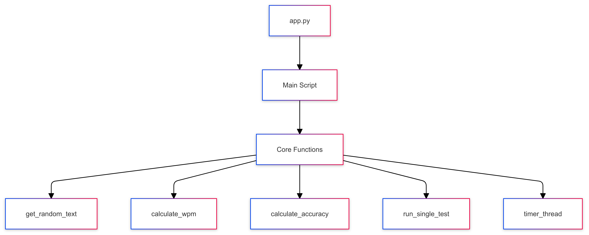

# 🚀 WPM Typing Test


A interactive command-line typing test application built with Python to measure your typing speed and accuracy in real-time.

## 📋 Table of Contents

- [Features](#features)
- [Technologies Used](#technologies-used)
- [Installation](#installation)
- [Usage](#usage)
- [Project Structure](#project-structure)
- [Learning Objectives](#learning-objectives)
- [Contributing](#contributing)
- [License](#license)
- [Contact](#contact)

## ✨ Features

- Real-time WPM (Words Per Minute) calculation
- Accuracy measurement
- Customizable test duration
- Cross-platform compatibility (Windows and Unix-based systems)
- Random selection of practice texts
- Live countdown timer

## 🛠️ Technologies Used

- Python 3.6+
- Standard Python libraries:
  - `threading` for timer implementation
  - `msvcrt` for Windows-specific input handling
  - `os` for cross-platform compatibility
  - `time` and `random` for core functionality

## 📥 Installation

1. Clone the repository:

```bash
git clone https://github.com/TheToriqul/WPM-Typing-Test.git
```

2. Navigate to the project directory:

```bash
cd WPM-Typing-Test
```

3. No additional dependencies are required as the project uses only Python standard libraries.

## 💻 Usage

1. Run the typing test:

```bash
python app.py
```

2. Enter your desired test duration (default is 60 seconds)
3. Press Enter to start the test
4. Type the displayed text as accurately and quickly as possible
5. View your results, including WPM and accuracy
6. Press 'R' to restart or any other key to exit

## 📁 Project Structure

<figure >
  <p align="center">
    
    <p align="center">Project Architecture Diagram</p> 
  </p>
</figure>

## 🎯 Learning Objectives

Through this project, you can learn about:

- Multi-threading in Python
- Cross-platform input handling
- Real-time console manipulation
- Performance metrics calculation
- Clean code organization and modularity

## 🔄 How to Use This Repository

To practice typing:

1. Run the application
2. Complete multiple tests to track improvement
3. Try different test durations to challenge yourself

To analyze your progress:

- Keep track of your WPM and accuracy scores
- Practice regularly with different text samples

## 📝 Notes

- The application uses different input handling methods for Windows and Unix-based systems
- Accuracy is calculated based on correctly typed whole words
- The timer is implemented using a separate thread to ensure smooth operation

## 🚀 Further Learning

- Add a persistent storage for tracking progress
- Implement a leaderboard system
- Add different difficulty levels
- Create a GUI version using tkinter or PyQt
- Add support for multiple languages

## 🤝 Contributing

1. Fork the repository
2. Create a new branch for your feature
3. Commit your changes
4. Push to the branch
5. Create a Pull Request

## 📞 Contact

For any questions or inquiries regarding the project, please feel free to contact:

- 📧 Email: toriqul.int@gmail.com
- 📱 Phone: +65 8936 7705, +8801765 939006

## 🔗 Project Links

- [GitHub Repository](https://github.com/TheToriqul/WPM-Typing-Test)

## 🙏 Acknowledgments

- Inspired by various online typing test platforms
- Thanks to the Python community for inspiration and best practices

---

Feel free to explore, modify, and expand upon this configuration as part of your learning journey!

Copyright © 2024 TheToriqul. All Rights Reserved.
